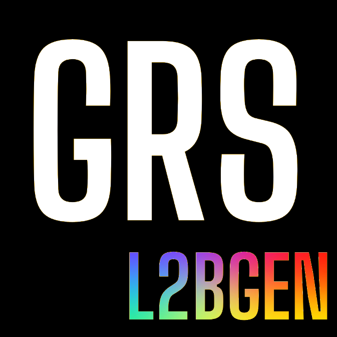
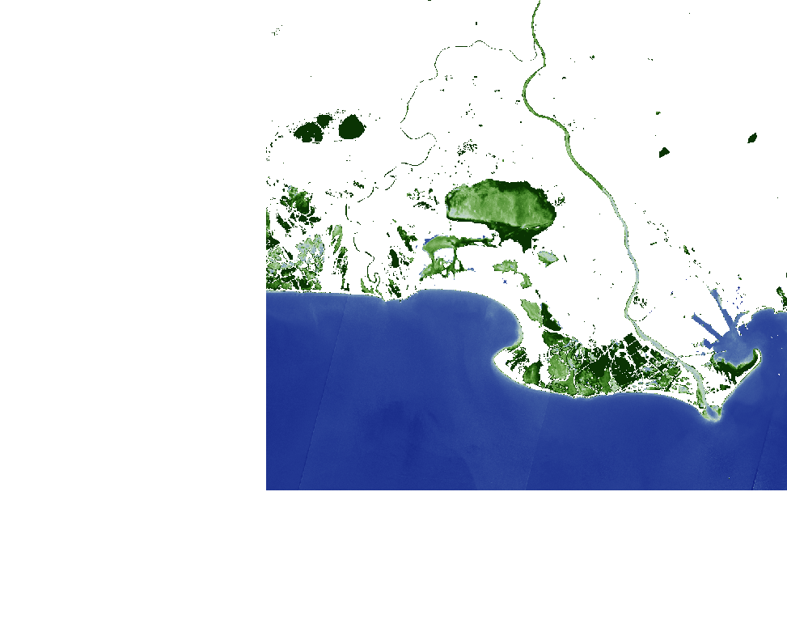

# GRSl2bgen


## **Scientific code to process GRS L2A images** 
## Estimation of water quality parameters from remote sensing reflectance (Rrs) 

## Getting Started

These instructions will get you a copy of the project up and running on your local machine for development and testing purposes.

### Prerequisites

What things you need to install the software and how to install them

```
conda install -c conda-forge rasterio xarray dask rioxarray
```

### Installing

First, clone [the repository](https://gitlab.cnes.fr/waterquality/obs2co_l2bgen.git#) and execute the following command in the
local copy:

```
pip install . 
```

## Some examples:



# Example
```
img_dir=/your_path_for_image_folder
GRSl2bgen $img_dir/ -o $img_dir/L2B/S2B_MSIL2B_20220731T103629_N0400_R008_T31TFJ_20220731T124834.nc
```


## Compile Docker image locally
First, you must get Dockerfile out of obs2co_l2bgen folder to have a structure as displayed below.

head_folder  
 ├GRSl2bgen  
 └Dockerfile

Note that anything in this folder tree will be added to the Docker build context, so make it light.
You might consider removing the notebooks and all useless files and directories from the GRSl2bgen
folder to make the resulting image as light as possible (.git, illustration, notebook...).

Once all those requirements are met, you can compile the Docker image using the following command:
```
docker build -t GRSl2bgen:<version_tag> *path_to_head_folder* -f *path_to_Dockerfile*
```

When the compilation has ended, you can access the image with the command:
```
docker images
```

To run the Docker image in a container on a S2 raster you can use the run_docker.sh script as follows:
```
./run_docker.sh <image_ID> <L2A_raster_name> <L2A_raster_path> <desired_name_for_output> <desired_path_for_output>
```

