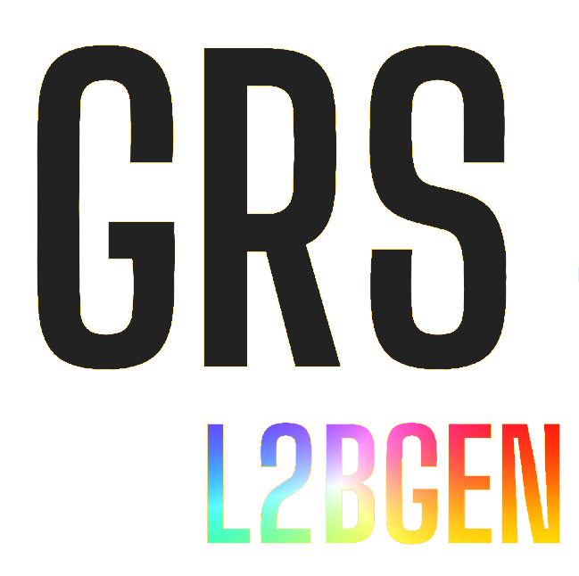
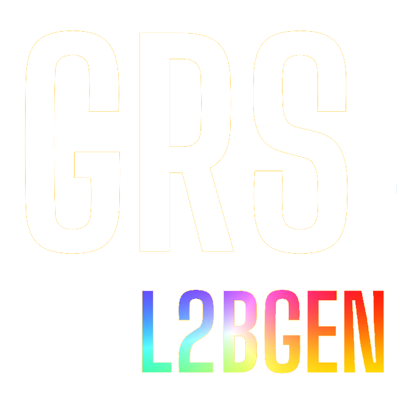

Processing Chain Description
=============================

This page documents GRSl2bgen following the
`Processing Chain Documentation Template <https://processing-chain-guidelines.readthedocs.io/en/latest/Data_processing_chain_template/>`_.

Process description
--------------------

Description
~~~~~~~~~~~

GRSl2bgen is a scientific processor that derives water-quality parameters from a GRS
Level-2A (Rrs, remote-sensing reflectance) product. Given one L2A product, it:

1. restricts the processing to valid water pixels (L2A ``mask == 0``);
2. classifies every pixel into Optical Water Types (OWT) against three databases
   (Spyrakos et al. 2018, Bi et al. 2024, Tarasenko et al. 2025) with the Spectral Angle
   Mapper (or, optionally, the Euclidean distance);
3. retrieves chlorophyll-a (stand-alone algorithms and an OWT-blended product), suspended
   particulate matter (SPM) and turbidity, colored dissolved organic matter (CDOM), and
   water transparency (Kd(PAR));
4. merges all of these into a single Level-2B product, written as NetCDF or Zarr
   (optionally as a multiscale Zarr pyramid for cloud visualisation).

The equations of every retrieval are given in :doc:`algorithms`.

The processor is invoked through the ``GRSl2bgen`` command-line executable
(entry point ``GRSl2bgen.run:main``, see :py:mod:`GRSl2bgen.run`), which wraps the core
:py:class:`GRSl2bgen.process.Process` class.

Application Domain (Granule)
~~~~~~~~~~~~~~~~~~~~~~~~~~~~~

One processing run (one granule) corresponds to **one GRS Level-2A product for one
acquisition date and one tile/footprint**, read as a single ``.nc``/``.zarr`` file or as a
directory containing a main file and its ``_anc.nc`` ancillary file (see
:py:class:`GRSl2bgen.product.Product`).

The output granule is a single Level-2B water-quality product (NetCDF, or Zarr when the
output path ends in ``.zarr``) covering the same footprint and resolution as the input L2A
product.

Scheduling and Triggers
~~~~~~~~~~~~~~~~~~~~~~~~

GRSl2bgen has no built-in scheduler; it is triggered externally, granule by granule:

- **Interactively / single granule**: manual call to ``GRSl2bgen <input_file>`` or to
  :py:class:`GRSl2bgen.process.Process` from Python (see `Examples`_ below).
- **Containerized**: via the Docker image built from
  `Dockerfile <https://github.com/CNES/GRSl2bgen/blob/main/Dockerfile>`_ and run with
  `run_docker.sh <https://github.com/CNES/GRSl2bgen/blob/main/run_docker.sh>`_ (see
  :doc:`index` "Compile Docker image locally"). The image is built and published by the CI
  pipeline (GitLab ``kaniko_build`` job in ``.gitlab-ci.yml``, and the GitHub
  ``podman-build``/``pypi`` jobs in ``.github/workflows/main.yml``).

There is no periodicity of its own; scheduling (e.g. reprocessing on new GRS L2A outputs)
is delegated to the calling scripts/workflow.

Examples
~~~~~~~~

**Command line.** Process one L2A product into a NetCDF L2B product:

.. code-block:: bash

   img_dir=/your_path_for_image_folder
   GRSl2bgen $img_dir/S2B_MSIL2Agrs_20220731T103629_N0400_R008_T31TFJ_20220731T124834.nc \
       -o $img_dir/L2B/S2B_MSIL2B_20220731T103629_N0400_R008_T31TFJ_20220731T124834.nc

Without ``-o``, the output is written to ``--odir`` (default: current directory) with
``L2Agrs`` replaced by ``L2B`` in the input file name. Add ``--no_clobber`` to skip
products that are already processed.

Write a cloud-ready multiscale Zarr store instead (the format follows the output
extension; ``--pyramid`` is ignored for NetCDF):

.. code-block:: bash

   GRSl2bgen $img_dir/S2B_MSIL2Agrs_20220731T103629_N0400_R008_T31TFJ_20220731T124834.nc \
       -o $img_dir/L2B/S2B_MSIL2B_20220731T103629_N0400_R008_T31TFJ_20220731T124834.zarr --pyramid

**Python.** The same chain, run on a local dask cluster:

.. code-block:: python

   from GRSl2bgen import Process

   proc = Process(
       'S2B_MSIL2Agrs_20220731T103629_N0400_R008_T31TFJ_20220731T124834.nc',
       l2b_path='L2B/S2B_MSIL2B_20220731T103629_N0400_R008_T31TFJ_20220731T124834.nc',
       n_workers=4,          # local dask.distributed cluster (None: threaded scheduler)
       persist_input=True,   # keep the masked L2A raster in memory, read it once
   )
   proc.run()                # execute() + write_output() in the same dask context

See the :doc:`tutorials/basics` and :doc:`tutorials/advanced` notebooks for
step-by-step examples of the OWT classification and blending.

Dataflow
--------

.. mermaid:: _diagrams/dataflow.mmd

Inputs
------

.. list-table::
   :header-rows: 1
   :widths: 20 15 65

   * - Data Type Name
     - Cardinality
     - Selection Criteria
   * - GRS Level-2A product (``<input_file>``)
     - 1..1 (mandatory)
     - Water-leaving reflectance (Rrs) product produced by
       `GRSprocessor <https://github.com/CNES/GRSprocessor>`_: a ``.nc`` file, a ``.zarr``
       store, or a directory containing ``<name>.nc`` plus its ``<name>_anc.nc`` ancillary
       file, passed as the positional CLI argument.

Outputs
-------

.. list-table::
   :header-rows: 1
   :widths: 30 15 55

   * - Data Type Name
     - Cardinality
     - Description
   * - Level-2B water quality product (NetCDF or Zarr)
     - 1..1
     - Merged product (see :py:class:`GRSl2bgen.output.L2bProduct`), see the variable
       list below, plus the ``flags``/``mask`` variables carried over from the input
       product (see `Data Types`_ below for naming).

The main variables are listed below; see :doc:`output_product` for the full
description (dimensions, attributes, quality flags, packing).

.. list-table:: Level-2B variables
   :header-rows: 1
   :widths: 35 15 50

   * - Variable
     - Unit
     - Description
   * - ``owt_index_Spyrakos2018``, ``owt_dist_Spyrakos2018``
     - --, rad
     - 3 best Spyrakos et al. (2018) classes (1-based) and their spectral angles,
       along the ``Nclasses`` dimension
   * - ``owt_index_Bi2024``, ``owt_dist_Bi2024``
     - --, rad
     - Best Bi et al. (2024) class and its spectral angle
   * - ``owt_index_Ta2025``, ``owt_dist_Ta2025``
     - --, rad
     - Best Tarasenko et al. (2025) class and its spectral angle
   * - ``Chla_OC2nasa``, ``Chla_M09B``, ``Chla_NIRB``
     - mg m\ :sup:`-3`
     - Chlorophyll-a from NASA OC2, Moses et al. (2009) and the NIR-blue ratio
   * - ``Chla_OWTblend_Ta2025``
     - mg m\ :sup:`-3`
     - OWT-blended chlorophyll-a (Tavares et al. 2025 recipe)
   * - ``SPM_nechad``, ``SPM_obs2co``
     - mg L\ :sup:`-1`
     - Suspended particulate matter
   * - ``TURB_dogliotti``
     - FNU
     - Turbidity (Dogliotti et al. 2015)
   * - ``acdom_B15``
     - m\ :sup:`-1`
     - CDOM absorption at 440 nm (Brezonik et al. 2015)
   * - ``Kd_par``
     - m\ :sup:`-1`
     - Diffuse attenuation coefficient of PAR (Roy and Das 2022)

Output formats
~~~~~~~~~~~~~~

The format follows the extension of the output path (see
:py:meth:`GRSl2bgen.output.L2bProduct.export`). In all formats the content and the
encoding are the same: continuous variables are packed into ``int16`` with a
per-variable ``scale_factor``/``add_offset`` and ``_FillValue = -32768`` (unpacked
automatically by ``xarray``), while ``flags`` and ``mask`` keep their own type.

.. list-table::
   :header-rows: 1
   :widths: 22 22 56

   * - Format
     - Selected by
     - Description
   * - NetCDF
     - any other extension (e.g. ``.nc``)
     - Single file, zlib compression (level 5), NetCDF chunks aligned with the
       processing chunks (:py:meth:`~GRSl2bgen.output.L2bProduct.export_to_netcdf`).
   * - Zarr
     - ``.zarr``
     - Single-resolution store, regular chunks equal to the processing chunks
       (:py:meth:`~GRSl2bgen.output.L2bProduct.export_to_zarr`).
   * - Zarr pyramid
     - ``.zarr`` + ``--pyramid`` (CLI) or ``pyramid=True``
       (:py:class:`~GRSl2bgen.process.Process`)
     - Cloud-ready multiscale store
       (:py:meth:`~GRSl2bgen.output.L2bProduct.export_to_zarr_pyramid`), see below.
       ``--pyramid`` is ignored, with a warning, for NetCDF output.

Zarr pyramid export
^^^^^^^^^^^^^^^^^^^

The pyramid store holds the L2B product at several spatial resolutions, so that a web
viewer or a cloud client can display a whole tile quickly from a coarse level and fetch
full-resolution chunks only where it zooms in.

**Layout.** One Zarr group per resolution level, ``0`` being the full resolution and
each next level being 2 times coarser. Every level is a complete L2B dataset (same
variables, packing, CRS and ``spatial_ref``). File names below are those of the Zarr
format 2 written with zarr-python 2.x:

.. code-block:: text

   S2B_MSIL2B_<...>.zarr/
   ├── .zgroup
   ├── .zattrs          # product attributes + "multiscales" description
   ├── .zmetadata       # consolidated metadata of the whole hierarchy
   ├── 0/               # full resolution (e.g. 10980 x 10980 px at 10 m)
   ├── 1/               # 1/2  (5490 px, 20 m)
   ├── 2/               # 1/4  (2745 px, 40 m)
   ├── ...
   └── 5/               # 1/32 (343 px, 320 m)

**Number of levels.** Levels are added while the smaller image side of the next level
stays at least 256 pixels: a 10980-pixel Sentinel-2 tile at 10 m gives levels 0 to 5;
at 20 m (5490 pixels), levels 0 to 4.

**Resampling.** From one level to the next, each block of 2 x 2 pixels is reduced to
one pixel:

- continuous variables (Chl-a, SPM, OWT distances, ...): block average ignoring NaN,

  .. math::

     v^{(l+1)}_{i,j} = \operatorname{mean}_{\text{valid}}
     \left\{ v^{(l)}_{2i,2j},\ v^{(l)}_{2i+1,2j},\ v^{(l)}_{2i,2j+1},\ v^{(l)}_{2i+1,2j+1} \right\}

- categorical variables (``flags``, ``mask``): nearest neighbour (top-left pixel of
  the block), which preserves the flag values.

Edge pixels that do not fill a complete block are trimmed, so the origin of the grid is
unchanged and the pixel size doubles at every level; the ``GeoTransform`` of
``spatial_ref`` is updated accordingly. All levels use the packing parameters of level 0.

.. note::

   The ``owt_index_*`` variables are class numbers but are block-averaged like the
   continuous variables, so on coarse levels they can take non-integer values at class
   boundaries. Use level ``0`` for quantitative OWT analysis.

**Chunks.** 512 x 512 pixels at every level (or the whole level when it is smaller), a
good size for web access.

**Metadata.** The root group carries the product attributes and a ``multiscales``
attribute describing the levels (following the evolving Zarr *multiscales*
convention):

.. code-block:: json

   {
     "multiscales": {
       "layout": [
         {"asset": "0"},
         {"asset": "1", "derived_from": "0",
          "transform": {"scale": [2.0, 2.0]}, "resampling_method": "average"}
       ],
       "resampling_method": "average",
       "categorical_variables": ["flags", "mask"],
       "categorical_resampling_method": "nearest",
       "dims": ["y", "x"]
     }
   }

The metadata of all groups are consolidated into a single ``.zmetadata`` file, so a
client discovers the whole hierarchy with one request.

**Performance.** The processing chain is evaluated only once, when level ``0`` is
written; each coarser level is computed from the level just written (read back from
the store), so the upstream processing is never repeated.

**Writing and reading.** From the command line:

.. code-block:: bash

   GRSl2bgen <L2A_input> -o <odir>/S2B_MSIL2B_<...>.zarr --pyramid

From Python, either through the processing chain or directly from an
:py:class:`~GRSl2bgen.output.L2bProduct` (to choose the number of levels, the minimum
size or the chunks):

.. code-block:: python

   import xarray as xr
   from GRSl2bgen import Process

   proc = Process(l2a_path, l2b_path='out/S2B_MSIL2B_<...>.zarr', pyramid=True)
   proc.run()

   # or, with custom settings, after proc.execute():
   # proc.l2b.export_to_zarr_pyramid('out/....zarr', min_size=512, chunks={'y': 256, 'x': 256})

   # read one level (the root group holds no data variables)
   full = xr.open_zarr('out/S2B_MSIL2B_<...>.zarr', group='0')
   overview = xr.open_zarr('out/S2B_MSIL2B_<...>.zarr', group='3')

Return Codes
------------

GRSl2bgen is a Python CLI (``docopt``-based). Unlike GRSprocessor, it does not configure a
dedicated file logger: log records go through the standard Python ``logging`` module at
``INFO`` level (see ``GRSl2bgen/__init__.py``), with no ``log_file.log``/``error.log`` written
to disk by default.

- ``0``: normal process exit, including the case where ``--no_clobber`` is set and the
  output file already exists (the granule is skipped after printing a message).
- Non-zero interpreter exit codes may occur for unhandled exceptions raised during
  processing (no top-level exception handler currently wraps :py:meth:`GRSl2bgen.process.Process.execute`),
  or for invalid CLI arguments rejected by ``docopt``.

Log Format
----------

No structured/file-based log format is currently defined; messages are emitted through the
root ``logging`` logger (``INFO`` level and above) and go to the console (stderr) by
default.

Required Resources
-------------------

No SLURM/HPC job scripts or documented resource budgets ship with this repository (unlike
GRSprocessor). Actual CPU/RAM/runtime needs depend on the input product's spatial resolution
and tile size. The chain is lazy (dask): data are read and computed chunk by chunk when the
output is written. The main settings are:

- ``n_workers`` / ``threads_per_worker`` of :py:class:`GRSl2bgen.process.Process`: run on a
  local ``dask.distributed`` cluster instead of the default threaded scheduler;
- ``persist_input``: keep the water-masked input raster in memory so that it is read only
  once (faster, needs enough RAM for the masked raster);
- ``chunk`` of :py:class:`GRSl2bgen.owt.OWT_process`: spatial chunk size of the OWT
  classification, computed by numba-compiled kernels (``Nproc`` is deprecated and unused).

.. list-table::
   :header-rows: 1
   :widths: 30 30 40

   * - Resource Type
     - Quantity
     - Source / notes
   * - Disk — input
     - size of one GRS L2A product (netCDF/Zarr, plus ancillary file if any)
     - depends on sensor/resolution
   * - Disk — output
     - one Level-2B product, continuous variables packed as ``int16`` (NetCDF: zlib
       compression, complevel 5; Zarr: optionally with pyramid levels)
     - written to ``-o``/``--odir`` (see :py:meth:`GRSl2bgen.output.L2bProduct.export`)

Data Types
----------

.. list-table::
   :header-rows: 1
   :widths: 18 32 15 35

   * - Data Name
     - Description
     - Granule
     - Nomenclature
   * - GRS Level-2A input product
     - Water-leaving reflectance (Rrs) product from GRSprocessor
     - one tile, one date
     - e.g. ``S2B_MSIL2Agrs_<datetime>_N<baseline>_R<orbit>_T<tile>_<datetime>.nc``
   * - Level-2B output product
     - NetCDF or Zarr water-quality product (OWT, chlorophyll-a, SPM, CDOM, transparency)
     - one tile, one date
     - input basename with ``L2Agrs`` replaced by ``L2B``, e.g.
       ``S2B_MSIL2B_<datetime>_N<baseline>_R<orbit>_T<tile>_<datetime>.nc`` (see
       :py:func:`GRSl2bgen.run.main`)
